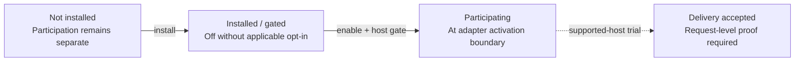
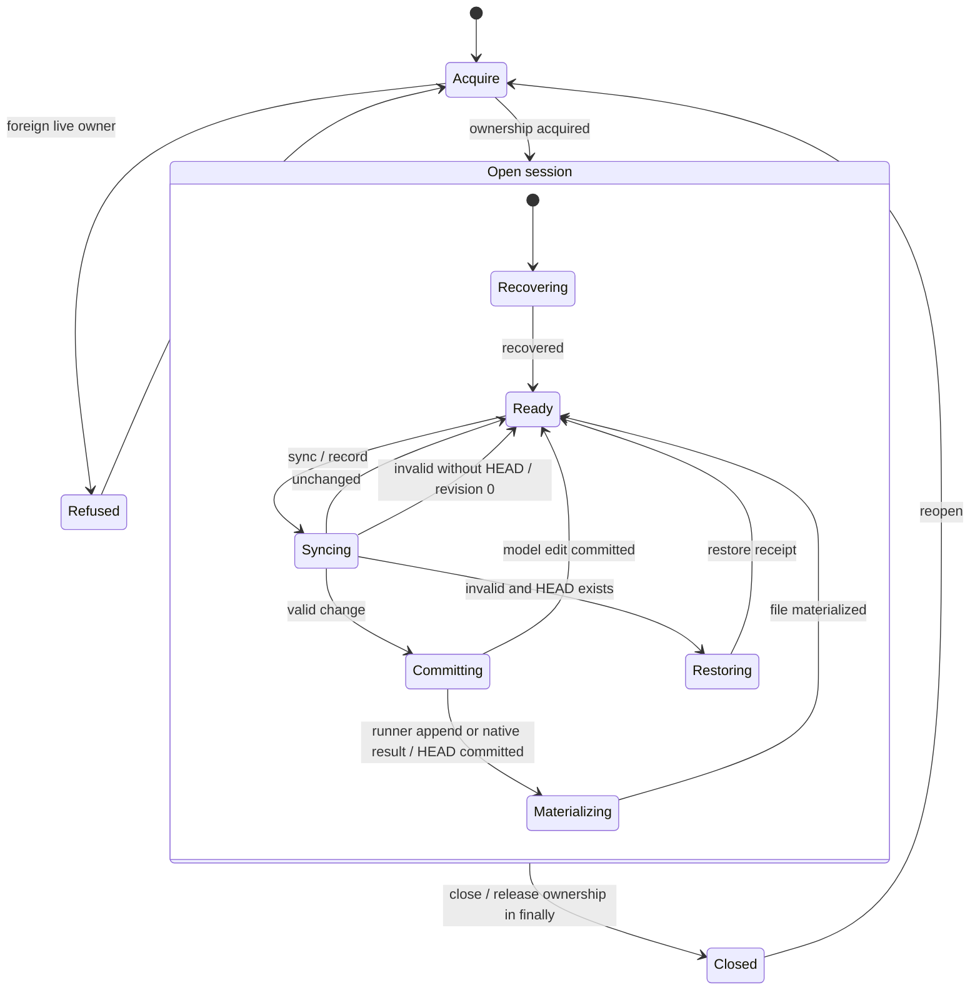
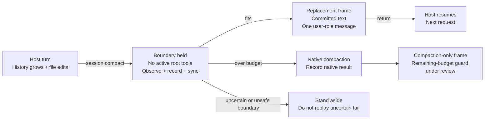
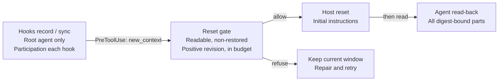

# Context Engine: release statechart and validation map

Published-source baseline inspected 6 October 2026 at 13:55 UTC. This is a read-only review model, not executable state-machine code or an architecture rewrite.

- Claude PR #1: [`e5da333fa144caf041feceb0fb1bbff120f6326c`](https://github.com/Jeff-Kazzee/context-engine-claude/pull/1)
- Codex PR #1: [`644d02b313d79017cfece32a0ddf066b8a940c3f`](https://github.com/Jeff-Kazzee/context-engine-codex/pull/1)
- Both published `SOURCE.json` manifests declare the same 30 core hashes and common core patch `783b50984a37c01ad527d31a099d41737b15c526`
- Owner-reported local candidates `9409e65` / `8e878d1` and core `7a50fab` were unavailable. This document does not verify those fixes
- No repository changes, installs, implementation tests, model calls, or live-host trials were performed for this review

## How to read this model

Diagrams describe published code or documented boundaries. The dashed acceptance edge is an intended validation condition, not established behavior. I1-I8 below are intended invariants that published code may violate. P1-P8 are proposed validation, not tests executed here. Review counterexamples remain hypotheses unless separately reproduced on a named head.

State names are explanatory abstractions mapped to existing functions. Installation, participation, session ownership, and observed delivery are distinct facts; the charts do not assert atomic transitions across those boundaries. No state-machine library, universal event priority, orthogonal atomicity, control-state history, or model-checker proof is assumed.

## 1. Activation and durable session lifecycle

Installing alone never proves participation or delivery. Shared state/participation can activate both already-installed adapters. The rollout default is off, and the kill switch takes precedence over participation records. Nearest explicit participation records determine scope; corrupt-record behavior is an unresolved review target below.

- **Disable:** write the scoped off record. Claude applies changes on a new session; Codex rechecks participation at each hook
- **Uninstall:** remove this runner's owned configuration, preserve unrelated edits and retained session records. Removing PATH links alone is not uninstall
- **Turn loop:** the separate Codex headless turn loop is explicitly opted into by launching it; it needs no project enable command and refuses to start under the kill switch

Open session is an XOR composite: entry acquires ownership then defaults to recovery. `record()` syncs first, appends the Event Log, applies events, commits snapshot then HEAD, and materializes the Working Context. Model-edit commits skip materialization. Invalid input with no HEAD remains uncommitted at revision 0.

**Recovery authority:** HEAD is the commit point. A crash before HEAD leaves an orphan snapshot to remove. Logged events with sequence greater than `HEAD.through` are replayed. A committed append that did not reach the editable file is rematerialized; an intervening stale-file edit is preserved in the Event Log with a restore notice. Reopening reconstructs durable data; it does not restore prior control-state history. Cache loss changes recovery cost, not the source of truth. Power-loss durability is a separate unresolved claim.

Inactive adapters leave the host native. Core failure or an ambiguous Claude boundary may make the adapter stand aside rather than retry an uncertain append. A diagram edge is not proof of filesystem confinement or cleanup success.

Implementation: [core/session.ts](https://github.com/Jeff-Kazzee/context-engine-claude/blob/e5da333fa144caf041feceb0fb1bbff120f6326c/core/session.ts), [core/lock.ts](https://github.com/Jeff-Kazzee/context-engine-claude/blob/e5da333fa144caf041feceb0fb1bbff120f6326c/core/lock.ts), [core/participation.ts](https://github.com/Jeff-Kazzee/context-engine-claude/blob/e5da333fa144caf041feceb0fb1bbff120f6326c/core/participation.ts), [setup/install.ts](https://github.com/Jeff-Kazzee/context-engine-claude/blob/e5da333fa144caf041feceb0fb1bbff120f6326c/setup/install.ts).

## 2. Delivery boundaries are different

An edited file, a committed revision, an accepted reset, and a verified next request are separate observations.

### Claude default

**Full Replacement per user turn; Injection within a turn.**

The interactive companion requests compaction at turn boundaries; headless hosts explicitly send `/compact`. Main-session tool starts wait behind the replacement boundary. External editors and subagents are not coordinated. A core fault, ambiguous frame, or unsafe Bash-tail observation can stand aside: plugin compaction may skip, while explicit/manual and automatic native paths retain their fallback behavior.

**Per-step experiment:** explicitly opt in, then build/sync/fit, request an opaque authorization handle, and send a custom step. Build, fit, authorization, or send failure delegates to the host. A host fallback is not proof of replacement. Keep this experiment off for initial acceptance. Its credential-like payload logging is separately under review.

Sources: [Claude register](https://github.com/Jeff-Kazzee/context-engine-claude/blob/e5da333fa144caf041feceb0fb1bbff120f6326c/adapters/claude/context-engine/hooks/register.ts), [Claude contract](https://github.com/Jeff-Kazzee/context-engine-claude/blob/e5da333fa144caf041feceb0fb1bbff120f6326c/adapters/claude/README.md).

### Codex plugin

**Full Replacement at agent-initiated resets; history grows between resets.**

The PreCompact token-limit/manual backstop has a readability and 16 MiB bound but no token-budget gate, and is labelled Compaction-only. A successful hook return does not prove the agent read every part or establish what the next model request contains.

### Codex turn loop: separate headless opt-in

`sync -> fresh ephemeral thread -> inject committed user message -> turn/start -> completion -> record`

The loop owns its stdio app-server and disables the plugin/token-budget reset path there. Revision 0 starts a fresh thread without injection. An undeliverable revision refuses the turn with `mode=null`, no model call, and no automatic old-thread continuation.

**Cancellation and recovery:** timeout or uncertain start recovers a known turn ID, requests interruption, and waits for terminal completion. If activity remains uncertain, it closes its owned RPC process and marks the loop unavailable. `close()` stops admission, closes RPC, awaits in-flight recording, then releases the session lock. Thread/turn IDs filter notifications; early notifications are buffered. Failed-injection resource disposal remains a review target.

Sources: [Codex hooks](https://github.com/Jeff-Kazzee/context-engine-codex/blob/644d02b313d79017cfece32a0ddf066b8a940c3f/adapters/codex/plugin/hooks/codex-hook.ts), [Codex contract](https://github.com/Jeff-Kazzee/context-engine-codex/blob/644d02b313d79017cfece32a0ddf066b8a940c3f/adapters/codex/README.md), [Codex turn loop](https://github.com/Jeff-Kazzee/context-engine-codex/blob/644d02b313d79017cfece32a0ddf066b8a940c3f/adapters/codex/turn-loop/turn-loop.ts).

## 3. Transition, invariant and test map

I = intended invariant; current code may violate it. P = proposed validation, not executed here. Test filenames identify existing suites to extend; their presence does not establish exact-case coverage.

| Transition / source | Invariant and observable outcome | Minimal proposed trace / test home |
| --- | --- | --- |
| T1 Off -> Participating participation(), locallyEnabled() | I1 No opt-in means no recording/import side effects. Kill switch wins; nearest explicit off blocks ancestor on. | P1 Parent on -> child off -> corrupt child record -> hook: remain inactive or error, never inherit on. participation.test.ts; codex-hook.test.ts |
| T2 Ready -> Sync -> Commit/Restore Core.sync(), record() | I2 Valid edits commit before appends; invalid edits restore and emit a receipt. Delivery uses the committed reply, not a later mutable-file reread. | P2 Edit old sentinel to new -> record -> sync: old absent from delivered revision. Invalid UTF-8/empty/linked/oversize -> restore. session/read/confinement tests |
| T3 Log -> Snapshot -> HEAD -> File Core.commit(), recover() | I3 HEAD is authority; each logged sequence is applied once. Cache loss changes cost, not truth. Process-crash safety and power-loss durability are distinct. | P3 Fault after log, before HEAD, before file; reopen -> one copy of each event; preserve intervening stale edit in log. Separate directory-fsync/power-loss test. recovery.test.ts |
| T4 Open/operate/close acquireLock(), serialized(), close() | I4 One owner; same-owner operations serialized; foreign live owner refused. Exit/error must not strand a lock. No guarantee of FIFO admission. | P4 Two contenders + owner crash; parallel hooks; close log error; retained-close A -> session B -> end B -> retry A. lock.test.ts; Claude hooks tests |
| T5 Claude boundary -> delivery/fallback session.compact, turn.step | I5 No duplicate tail recording after uncertainty; pinned prefix/permissions preserved; Working Context stays user authority. Mode describes actual boundary. | P5 Active tool or ambiguous frame -> stand aside; lost record reply -> no replay; oversized fallback summary -> preserve native result. Fresh session resets turn-local flags. Claude hooks/per-step tests |
| T6 Codex reset -> agent read-back resetRefusal(), PreCompact | I6 Agent reset denied if unsafe or over budget; native backstop only checks deliverability. Reset acceptance alone is not delivery proof. | P6 9 MiB context -> serialized CLI reply fits IPC or fails explicitly; restored receipt -> reset denied; change multipart digest -> restart read. codex-hook/read tests |
| T7 Fresh thread -> running -> interrupted/closed runOneTurn(), startAndWait() | I7 Never continue old history after failed injection. Correlate thread/turn IDs. Unknown activity cannot be reused; owned resources eventually released. | P7 Start succeeds -> inject fails -> repeat: no leaked subscription. Lost start reply + late completion; timeout/interrupt race; close during record. turn-loop.test.ts; jsonrpc.test.ts |
| T8 Disable/uninstall/rollback setup project + ledger | I8 Preserve unowned config, exact bytes, and retained session data. All private reads/writes stay confined before any external effect. | P8 Concurrent config edit + install failure -> preserve bytes; linked backup/ledger refused; absent managed file restored to absence where owned. setup hosted/review regression tests |

**Execution profile:** synchronous core effects inside admitted calls; separate operation and append leases. Claude's asynchronous boundary gate guards replacement but provides no universal host-event queue guarantee. Codex notifications filter IDs and buffer early arrivals. No assumed child-first priority, global run-to-completion, orthogonal atomicity, history restoration, or model-checker proof. Session and lock identities, revisions, sequence numbers, budgets, frame keys, paths, and thread/turn IDs are context data, not additional lifecycle states. Concurrent external edits, late completions, and failure races need explicit tests rather than diagram-order assumptions.

## 4. Release checks tied to counterexamples

These are **unresolved hosted review claims**, with published-source observations where inspected. Counterexample sequences are test plans, not reproduced failures. Existing owner fixes may already change them; validate against the next published exact heads. The links identify the reviewed claim, not an instruction to implement it without verification.

| Review / target | Counterexample to validate | Required outcome / invariant |
| --- | --- | --- |
| [Nearest participation record](https://github.com/Jeff-Kazzee/context-engine-codex/pull/1#discussion_r4195563529) | Ancestor on -> descendant off record malformed -> lookup ascends. Published findRecord()/locallyEnabled() visibly continue. | Fail closed at existing invalid nearest record (I1). |
| [Revision reads](https://github.com/Jeff-Kazzee/context-engine-claude/pull/1#discussion_r4195865257); [Event Log links](https://github.com/Jeff-Kazzee/context-engine-claude/pull/1#discussion_r4195589656) | Replace revision/log with link -> open/sync or append. Published snapshot uses readBytes/readFileSync; log open/truncate are pathname-based. | No target bytes read, truncated, appended or delivered; verify descriptors and anchors (I8). |
| [Directory creation](https://github.com/Jeff-Kazzee/context-engine-claude/pull/1#discussion_r4195589668); [Backup writes](https://github.com/Jeff-Kazzee/context-engine-claude/pull/1#discussion_r4195865271); [Ledger reads](https://github.com/Jeff-Kazzee/context-engine-claude/pull/1#discussion_r4195589624) | Swap managed parent or backup tree -> mkdir/copy/read. Post-check must not come after external mutation. | No out-of-root effect; confined create/read/write throughout (I8). |
| [Snapshot durability](https://github.com/Jeff-Kazzee/context-engine-codex/pull/1#discussion_r4195563498) | Snapshot rename -> HEAD rename -> power loss -> HEAD survives but snapshot entry does not. | Fsync appropriate parent directories; test actual durability assumptions (I3). |
| [Whole-log reads](https://github.com/Jeff-Kazzee/context-engine-claude/pull/1#discussion_r4195865283); [Cited source size](https://github.com/Jeff-Kazzee/context-engine-claude/pull/1#discussion_r4195589633); [Hook IPC](https://github.com/Jeff-Kazzee/context-engine-codex/pull/1#discussion_r4195563476) | Large log/source or duplicated 9 MiB reply -> allocation/IPC bound exceeded before small output limit. | Bound/stream inputs; size IPC for serialized payload, including escaping (I2/I6). |
| [Retained closes](https://github.com/Jeff-Kazzee/context-engine-claude/pull/1#discussion_r4195865262); [Turn-local flags](https://github.com/Jeff-Kazzee/context-engine-claude/pull/1#discussion_r4195589675) | Close A fails -> start B -> close B; or A edits -> new session -> first Read. | Keep cleanup ownership; clear session-local stubbing flags (I4/I5). |
| [Fallback budget](https://github.com/Jeff-Kazzee/context-engine-claude/pull/1#discussion_r4195865305); [Per-step cost log](https://github.com/Jeff-Kazzee/context-engine-claude/pull/1#discussion_r4195865295) | Fallback summary still over budget -> frame it; credential-like synthetic payload -> heuristic log path. | Do not frame undeliverable summary; no durable credential payload copies (I5/I8). |
| [Failed thread injection](https://github.com/Jeff-Kazzee/context-engine-codex/pull/1#discussion_r4195563542) | thread/start succeeds -> inject rejects -> retry. Published catch precedes assigning threadId/cleanup. | Dispose fresh thread; preserve prior handle without continuing it (I7). |
| [Marker-only repair](https://github.com/Jeff-Kazzee/context-engine-codex/pull/1#discussion_r4195563520); [Escaped TOML](https://github.com/Jeff-Kazzee/context-engine-codex/pull/1#discussion_r4195563513); [Rollback bytes](https://github.com/Jeff-Kazzee/context-engine-claude/pull/1#discussion_r4195556374); [Rollback absence](https://github.com/Jeff-Kazzee/context-engine-claude/pull/1#discussion_r4195589644) | Keep markers but remove values; escaped equivalent key; invalid bytes decode equally; created tracked file fails install. | Validate effective owned config; byte-exact concurrent-edit checks; restore owned absence (I8). |

## Evidence and remaining release gate

- [Claude PR #1](https://github.com/Jeff-Kazzee/context-engine-claude/pull/1) reports **29 passed / 11 explicit Codex-only skips (40 total)** at `e5da333`
- [Codex PR #1](https://github.com/Jeff-Kazzee/context-engine-codex/pull/1) reports **63 passed / 4 Claude-only skips + 1 real-host hold (68 total)** at `644d02b`
- The PR descriptions report pinned typechecks and affected offline setup runs. These are **author-reported results, not rerun in this review**. Earlier full core/adapter suites belong to earlier heads
- Persistent installation, real next-request delivery, and long-session acceptance remain **unverified**. Passing offline checks, a successful status command, or changed `context.md` is insufficient proof
- A supported-host trial must use harmless old/new sentinels: demonstrate old text absent, new text delivered, Working Context at the documented authority, and runner instructions/tools/permissions preserved. Do not expand logging or permissions merely to obtain evidence
- Validate the next exact published heads, complete independent review, and obtain Jeff's exact-head approval. Supported-host acceptance remains a separate gate

### Provenance limits

The artifact records only the published baseline above. It must not be labelled as validation of later local or published fixes without a new source-and-test pass. Both source manifests ([Claude](https://github.com/Jeff-Kazzee/context-engine-claude/blob/e5da333fa144caf041feceb0fb1bbff120f6326c/SOURCE.json), [Codex](https://github.com/Jeff-Kazzee/context-engine-codex/blob/644d02b313d79017cfece32a0ddf066b8a940c3f/SOURCE.json)) declare matching shared-core hashes; this review did not rerun a full hash audit. Rendered diagrams are review aids, not proof of executable semantics, filesystem confinement, actual host delivery, or test completion.
